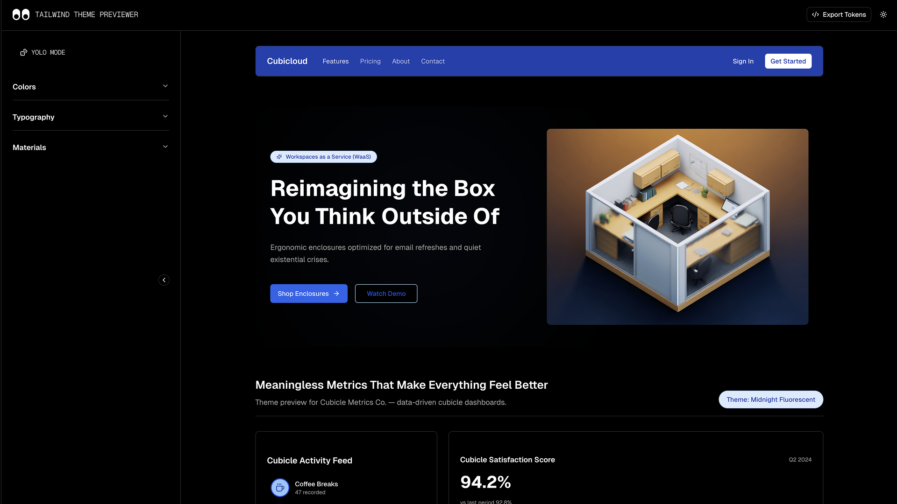

# Tailwind Theme Previewer



## Overview

Tailwind Theme Previewer is a Next.js application that lets you create, customize, and preview complete design systems. Featuring YOLO mode for random theme generation, dynamic theme naming, interactive animated eyes that react to user actions, and a fire emoji confetti celebration on export.

## Features

### Core Functionality
- **Interactive Brand Token Editor** - Customize colors, typography, spacing, and shadows in real-time  
- **YOLO Mode** - Randomly generate complete design systems with contextually-named themes  
- **Live Preview Dashboard** - See your design tokens applied to a satirical "Cubicle Metrics" dashboard  
- **Multi-Format Export** - Download design tokens as CSS variables, Tailwind v3 config, or Tailwind v4 config  
- **Dynamic Theme Naming** - Automatically generates creative theme names based on primary color hue  

### Interactive Elements
- **Animated Eyes** - Eyes in the navbar that track cursor movement and react with shocked expressions  
- **Fire Confetti Celebration** - Exploding fire emojis from all corners when exporting tokens  
- **Collapsible Sidebar** - Responsive controls panel that adapts to mobile and desktop  

### Design Token Categories
- **Colors** - Primary brand color with 9 shades, plus 3 neutral colors  
- **Typography** - Font families (heading, body, mono), sizes, weights, and line heights  
- **Spacing** - Consistent spacing scale from xs to 3xl  
- **Borders** - Border radius tokens (sm, md, lg, full)  
- **Shadows** - Shadow presets (sm, md, lg, xl)  

### Preview Components
- **Cubicle Activity Feed** - Live metrics with satirical workplace categories  
- **Satisfaction Score Chart** - Bar graph with vertical grid lines  
- **Stats Cards** - Income, Expenses, and Savings with sparkline graphs  
- **Button States** - Primary and Soft button variants (default, hover, active, disabled)  
- **Theme Token Display** - Visual reference of current design system values  

## Tech Stack

- **Framework:** Next.js 15 with App Router  
- **Language:** TypeScript  
- **Styling:** Tailwind CSS v4  
- **UI Components:** shadcn/ui  
- **Color Processing:** tinycolor2  
- **State Management:** React hooks with Context API  
- **Fonts:** Geist Sans and Geist Mono  

## Project Structure

```text
tailwind-theme-previewer/
├── app/
│   ├── layout.tsx               # Root layout with fonts and metadata
│   ├── page.tsx                 # Main page with sidebar and preview
│   └── globals.css              # Tailwind v4 config and theme tokens
├── components/
│   ├── animated-eyes.tsx        # Interactive eyes with cursor tracking
│   ├── app-navbar.tsx           # Header with logo and eyes
│   ├── brand-color-manager.tsx  # Color palette editor with YOLO mode
│   ├── brand-controls-panel.tsx # Main control panel container
│   ├── brand-preview.tsx        # Live preview dashboard
│   ├── design-tokens-sheet.tsx  # Export modal with fire confetti
│   ├── emoji-confetti.tsx       # Fire emoji animation system
│   ├── mobile-controls-menu.tsx # Mobile drawer for controls
│   └── ui/                      # shadcn/ui components
├── hooks/
│   └── use-brand-tokens.ts      # Global state management for design tokens
├── lib/
│   ├── color-utils.ts           # Color generation and manipulation
│   └── theme-name-generator.ts  # Dynamic theme naming based on hues
├── types/
│   └── brand.ts                 # TypeScript interfaces for design tokens
└── public/
    ├── cubicloud-hero.png       # 3D isometric cubicle office render
    └── Tailwind_Theme_Previewer.png
```

## Installation

```bash
# Clone the repository
git clone https://github.com/yourusername/tailwind-theme-previewer.git

# Navigate to the project directory
cd tailwind-theme-previewer

# Install dependencies
npm install

# Run the development server
npm run dev
```

Open [http://localhost:3000](http://localhost:3000) to view the application.

## Usage

### Creating a Theme

1. **Open the Controls Panel** - Click the sidebar button or use the mobile menu  
2. **Customize Brand Tokens:**
   - **Colors:** Select primary brand color and neutrals  
   - **Typography:** Choose fonts, sizes, and weights  
   - **Spacing:** Adjust spacing scale values  
   - **Borders:** Set border radius tokens  
   - **Shadows:** Configure shadow presets  
3. **Preview in Real-Time** - See changes instantly in the dashboard preview  
4. **Export Your Theme** - Click "Export Tokens" for CSS, Tailwind v3, or Tailwind v4 formats  

### YOLO Mode

Click the "YOLO" button in the color manager to randomly generate a complete design system:

- Randomly selects a primary brand color  
- Generates 9 color shades automatically  
- Picks 3 complementary neutral colors  
- Creates a contextually-named theme (e.g., "Arctic Cascade" for blue, "Coral Sunset" for orange)  
- Updates the entire preview instantly  

### Interactive Features

- **Eye Tracking:** Move your cursor across the navbar to see the eyes follow  
- **Export Celebration:** Click "Export Tokens" to trigger fire emoji confetti from all corners  
- **Shocked Eyes:** Eyes grow wide when confetti animation plays  
- **Responsive Layout:** Collapsible sidebar adapts to mobile and desktop viewports  

## Design System

### Color Generation

The app uses tinycolor2 to generate 9 shades from a base color:

- Shades 50–400: Lighter tints  
- Shade 500: Base color  
- Shades 600–900: Darker tones  

### Theme Naming

Dynamic names are generated based on primary color hue ranges:

- **Blues (190–250°):** Arctic Cascade, Ocean Depths, Midnight Sky, Sapphire Dream, Azure Horizon  
- **Greens (90–170°):** Emerald Isle, Forest Canopy, Mint Breeze, Jade Garden, Olive Grove  
- **Purples (270–330°):** Violet Dusk, Lavender Fields, Plum Twilight, Orchid Bloom, Amethyst Crown  
- **Reds (330–30°):** Crimson Fire, Ruby Glow, Scarlet Dawn, Cherry Blossom, Burgundy Wine  
- And more...

### Typography Scale

- **Headings:** 3xl (1.875rem), 2xl (1.5rem), xl (1.25rem), lg (1.125rem)  
- **Body:** base (1rem), sm (0.875rem), xs (0.75rem)  
- **Weights:** Regular (400), Medium (500), Semibold (600), Bold (700)  

## Satirical Theme: Cubicloud

The preview showcases a "Cubicle Metrics Dashboard" with tongue-in-cheek corporate humor:

- **Cubicle Activity Feed:** Coffee Breaks, Paper Jams Fixed, TPS Reports Filed, Meetings Survived  
- **Satisfaction Score:** "94.2% - Metrics not evaluated by HR"  
- **Meaningless Metrics:** Data-driven dashboards scientifically designed to justify workspace investment  

## Export Formats

### CSS Variables

```css
:root {
  --color-primary-500: #3b82f6;
  --font-heading: 'Geist', sans-serif;
  --spacing-md: 1rem;
}
```

### Tailwind v3 Config

```js
module.exports = {
  theme: {
    extend: {
      colors: {
        primary: { 500: '#3b82f6' }
      }
    }
  }
}
```

### Tailwind v4 Config

```css
@theme inline {
  --color-primary-500: #3b82f6;
  --font-heading: 'Geist';
}
```

## Contributing

Contributions are welcome! Feel free to open issues or submit pull requests.

## License

MIT License - feel free to use this project for personal or commercial purposes.

## Acknowledgments

- Built with Next.js 15 and Tailwind CSS v4  
- UI components from shadcn/ui  
- Inspired by corporate cubicle culture and data-driven decision making  
- Hero image: 3D isometric office cubicle render  
